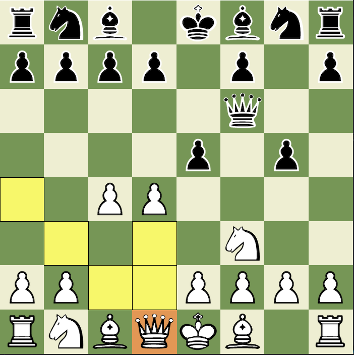
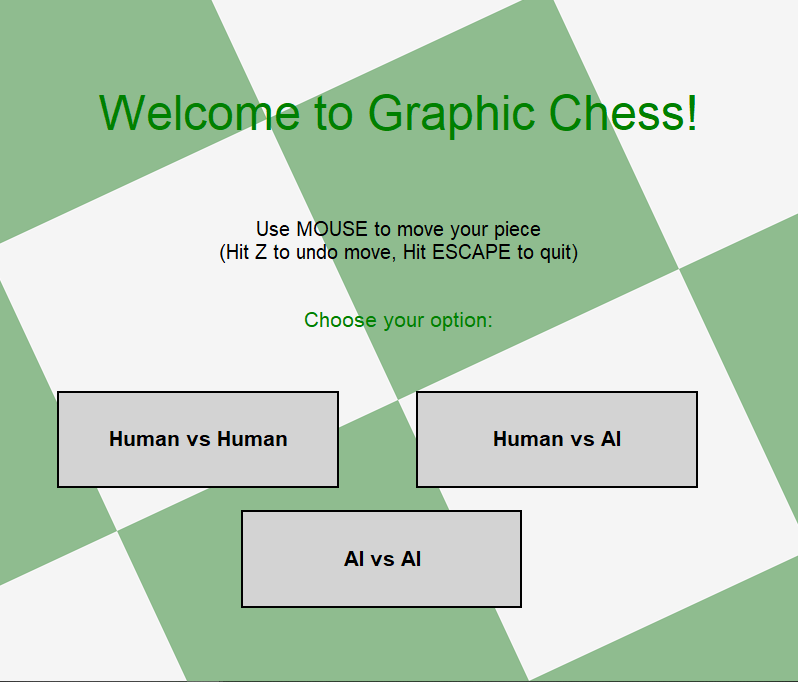

# Graphic Chess

Graphic Chess is a GUI chess game implemented in simple graphics.py of python

<p align="center">
    
    
</p>

## Installation

Install Graphic Chess by downloading the sources code and running:

```
python main.py
```

Enjoy the game!

## Features

- Play in 3 different modes:
  - Human vs Human
  - Human vs (dumb) AI
  - AI vs AI
- Undo and Reset the game using "z" and "r" key
- Highlighting moves
- Handling pawn promotion & enpassant
- Dumb AI

## Instructions

- Use MOUSE click to move your piece
- Hit `z` to undo move
- Hit `r` to reset the game
- Hit `ESCAPE` to quit

## Reflection

It's quite a fun journey when I had chance to build the whole little game from ground up. I was able to learn more about how chess work under the hood. The hardest part is when I needed to figure out the algorithms of the rules to handle all the chess pieces' moves and special case (pawn promotion, enpassant)
